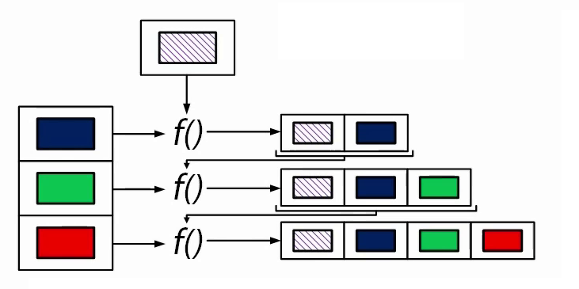

Array.reduce / Array.fold
=============

Array.reduce
*************

Функция `Array.reduce <https://msdn.microsoft.com/en-us/visualfsharpdocs/conceptual/array.reduce%5B%27t%5D-function-%5Bfsharp%5D?f=255&MSPPError=-2147217396>`_
является своеобразной альтернативой циклам. 
Она последовательно применяет функцию, которую вы пожелаете, к каждому из элементов массива.
Массив при этом должен иметь хотя бы 1 элемент. В противном случае получим исключение.

Принцип работы reduce примерно такой:
 1. Запоминаем значение первого элемента массива в переменную acc (аккумулятор)
 2. Вызываем функцию f и передаем в нее два аргумента: аккумулятор и следующий элемент массива
 3. Записываем в переменную acc значение, полученное на предыдущем шаге.
 4. Повторяем шаги 2 и 3 до тех пор, пока не достигнем конца массива.
 5. Возвращаем значение аккумулятора.

Не трудно заметить, что основным недостатком функции reduce является то, 
что тип возвращаемого результата должен совпадать с типом элемента массива. 

Если у вас массив строк - то результатом reduce может быть только строка.

Но не стоит отчаиваться, ведь есть более гибкая версия этой функции - Array.fold

Array.fold
***********

Принцип работы `Array.fold <https://msdn.microsoft.com/en-us/visualfsharpdocs/conceptual/array.fold%5B%27t,%27state%5D-function-%5Bfsharp%5D?f=255&MSPPError=-2147217396>`_ 
почти такой же как у reduce. Основные отличия:

 * аккумулятор инициализируете вы сами
 * функция f применяется и к первому элементу

Тип аккумулятора, и, следовательно, тип возвращаемого значения, может отличаться от типа элемента массива.

Например, если у вас массив строк, то результатом может быть массив каких-либо объектов, чисел и т.д.

На базе Array.fold работают более изощренные функции, такие как Array.fold2, Array.foldBack
