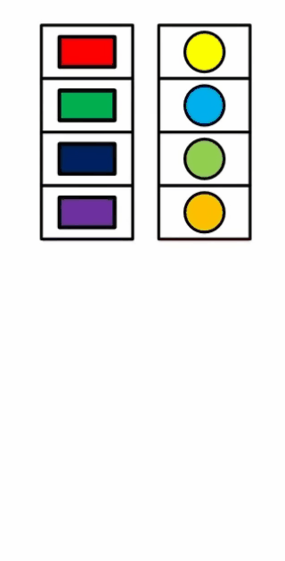

Array.zip
==========

Функция `Array.zip <https://msdn.microsoft.com/en-us/visualfsharpdocs/conceptual/array.zip%5B%27t1,%27t2%5D-function-%5Bfsharp%5D?f=255&MSPPError=-2147217396>`_:
     * принимает на вход два массива одинаковой длины
     * возвращает массив кортежей, где каждый кортеж состоиз из соотв. элементов исходных массивов
     * если длина массивов разная - выбросит исключение

Если вы хотите "склеить" 3 массива - используйте `Array.zip3 <https://msdn.microsoft.com/en-us/visualfsharpdocs/conceptual/array.zip3%5b't1,'t2,'t3%5d-function-%5bfsharp%5d>`_

Для обратной операции есть функция `Array.unzip <https://msdn.microsoft.com/en-us/visualfsharpdocs/conceptual/array.unzip%5B%27t1,%27t2%5D-function-%5Bfsharp%5D?f=255&MSPPError=-2147217396>`_